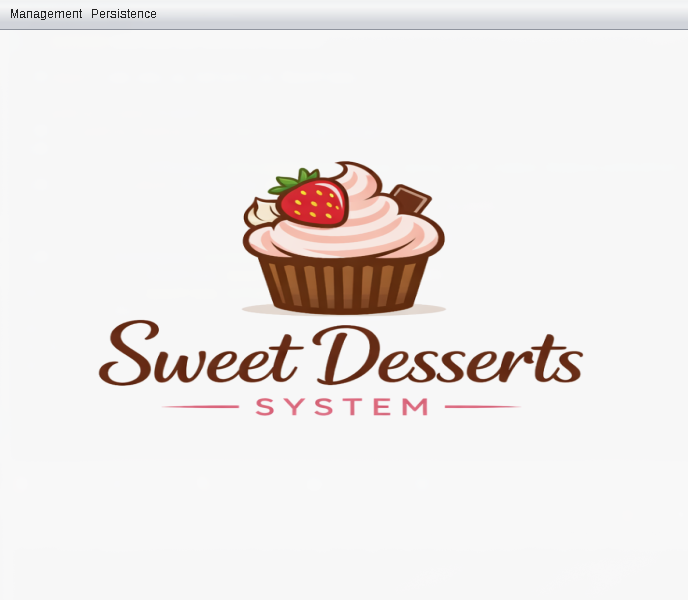
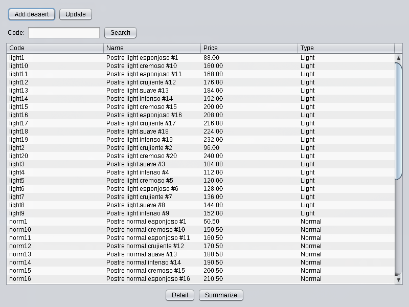
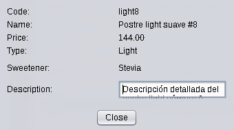
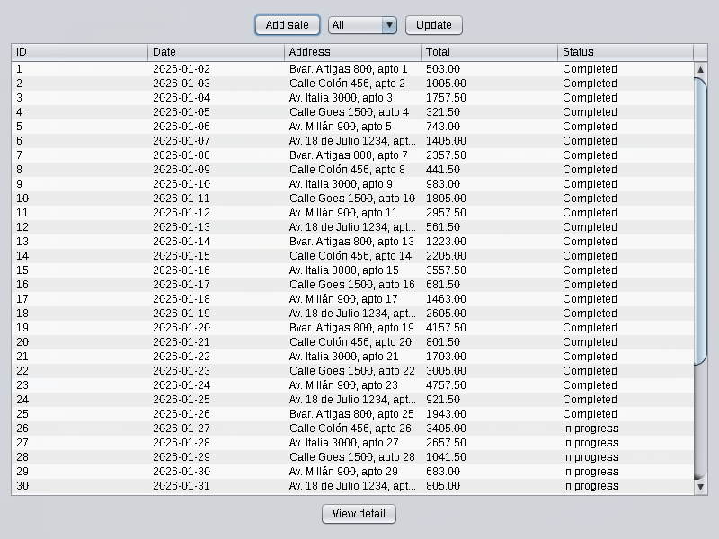
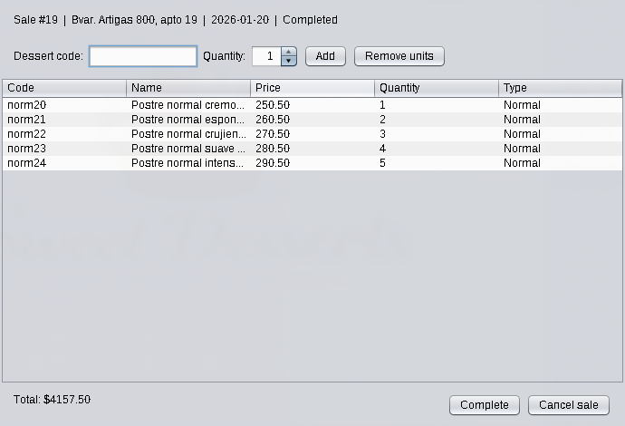
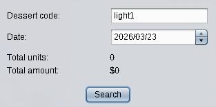

# Dessert Management System

A distributed desktop application for managing a dessert catalog and sales, built with Java RMI for client-server communication and Java Swing for the user interface.

## Screenshots








## Overview

This system allows users to manage a dessert catalog (normal and light desserts) and handle sales operations including adding/removing items, completing or canceling sales, and querying sales summaries by dessert and date. Data is persisted between sessions using Java serialization.

## Architecture

The application follows a three-layer architecture:

```
Client (Swing UI)
      ↓
Controllers (BaseController + RMI)
      ↓
ILogicLayer (RMI Remote Interface)
      ↓
LogicLayer (Server-side Singleton)
      ↓
Collections (Desserts, Sales) + Persistence
```

**Client** — Java Swing interface with SwingWorker for async table loading.

**Controllers** — Each controller extends `BaseController<V>`, which handles RMI connection and centralizes error handling. `RMIConnection` is a singleton that maintains a single connection per client instance.

**Logic Layer** — `LogicLayer` is a remote singleton that implements `ILogicLayer`. All business logic and validation lives here. A custom `Monitor` handles concurrent access with multiple readers / single writer semantics.

**Persistence** — Java serialization to `data/data.dat`. `AppData` wraps `Desserts` and `Sales` collections. Data is loaded automatically on server startup.

## Concurrency

The `Monitor` class implements a readers-writers lock:
- Multiple clients can read simultaneously
- Write operations are exclusive
- All operations use `try/finally` to guarantee lock release even on exceptions

## Technologies

- Java 21
- Java RMI (Remote Method Invocation)
- Java Swing with Nimbus Look and Feel
- Java Serialization
- Maven

## Project Structure

```
src/main/java/ude/edu/uy/taller2/
├── client/
│   ├── Client.java
│   └── controller/
│       ├── BaseController.java
│       ├── RMIConnection.java
│       ├── dessert/
│       ├── sale/
│       └── persistence/
├── server/
│   ├── Server.java
│   ├── collection/
│   ├── domain/
│   └── persistence/
├── logic/
│   ├── ILogicLayer.java
│   ├── LogicLayer.java
│   └── Monitor.java
├── dto/
├── exception/
├── ui/
│   ├── MainFrame.java
│   ├── dessert/
│   └── sale/
├── script/
│   └── SeedData.java
└── Config.java
```

## Getting Started

### Prerequisites

- Java 21+
- Maven

### Configuration

Edit `config/config.properties`:

```properties
server.host=localhost
server.port=1099
server.name=DessertSystem
```

If the file is not found, the application falls back to these same default values.

### Running

**1. Start the server**
```bash
mvn exec:java -Dexec.mainClass="ude.edu.uy.taller2.server.Server"
```

**2. Start the client**
```bash
mvn exec:java -Dexec.mainClass="ude.edu.uy.taller2.client.Client"
```

**3. (Optional) Load seed data**
```bash
mvn exec:java -Dexec.mainClass="ude.edu.uy.taller2.script.SeedData"
```

This creates 30 normal desserts, 20 light desserts, and 40 sales (25 completed, 15 in progress).

## Features

- **Dessert catalog** — Create normal and light desserts, search by code, view details
- **Sales management** — Create sales, add/remove dessert units (max 40 per sale), complete or cancel
- **Sales summary** — Query total units and revenue by dessert and date (completed sales only)
- **Persistence** — Save and restore application state via the Persistence menu
- **Multi-client support** — Multiple clients can connect simultaneously with concurrency control